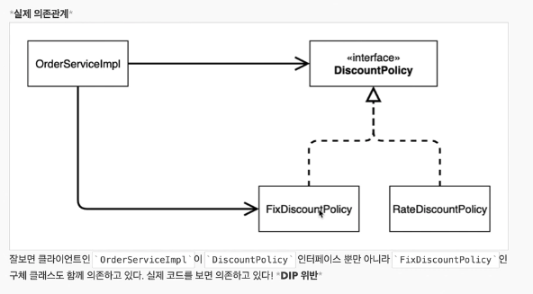
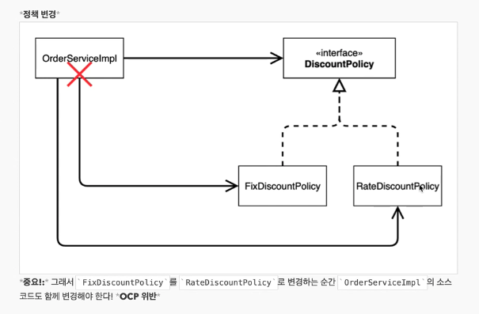

# 새로운 할인 정책 적용과 문제점


인터페이스를 이용해서 역할과 구현을 분리해서 작성했는데 무엇이 문제일까?


## DIP: 구현 클래스에 의존하고 있기 때문에 DIP 원칙을 못지킴




```java
public class OrderServiceImpl implements OrderService {

    private final MemberService memberService = new MemberServiceImpl();
//    private final DiscountPolicy discountPolicy = new FixDiscountPolicy();
    private final DiscountPolicy discountPolicy = new RateDiscountPolicy();

    @Override
    public Order createOrder(Long memberId, String itemName, int itemPrice) {
        Member member = memberService.findMember(memberId);
        int discount = discountPolicy.discount(member, itemPrice);
        return new Order(memberId, itemName, itemPrice, discount);
    }
}
```


## OCP 원칙 위반





## 해결 방법

DPI 원칙 준수 -> 추상에만 의존하도록 변경 (인터페이스)

