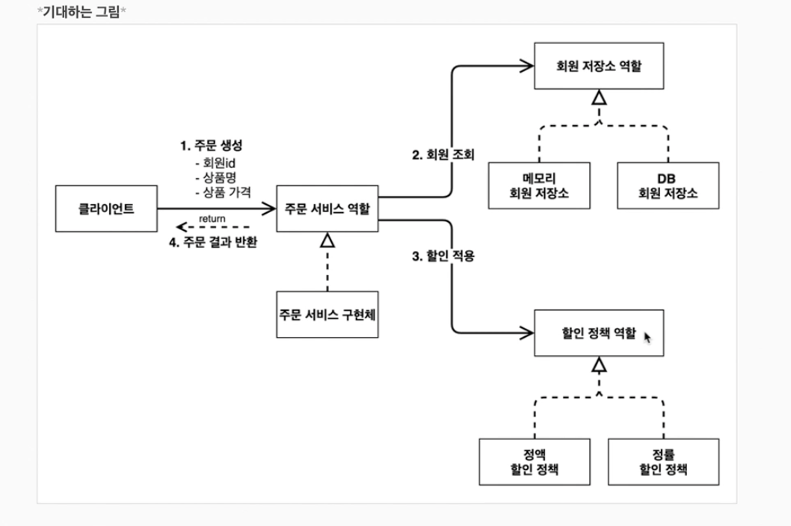

# AppConfig 리팩터링

현재 프로젝트에서 AppConfig은 프로젝트에서 사용되는 객체들의 구성을 관리한다. (공연의 기획자)

각각의 구성 객체들의 역할이 잘 들어날 수 있게 구성을 해보자

=> 생성자를 직접 사용하는 방법보다 해당 객체를 리턴하는 메서드를 만들어서 그 역할을 명시

## 강의노트

### AppConfig의 문제점

전체 코드의 역할이 보이지 않는다.

해당 역할을 볼 수 있게 리팩터링 하자

